<h1 align="center">OFANS</h1>
<h3 align="center">JavaFX Desktop application</h3>

## Introduction
De nos jours, Beaucoup des gens considérent les réseaux sociaux et les platformes de communication comme une partie essentielle dans la vie personnel et professionel. Ce travail est un projet d'école dont on a crée une application qui permettre de communiquer deux ou plusieurs utilisateurs dans une room en utilisant les sockets en Java et JavaFX pour les interfaces graphiques.

## Développer par
- [@OumaimaTaj](https://github.com/OumaimaTaj)
- [@Fatihabardiche](https://github.com/Fatihabardiche)
- [@NaciriAli](https://https://github.com/NaciriAli)
- [@Nour Elhouda Taroudi](https://github.com/nourelhouda-taroudi)
- [@Saddoug](https://github.com/Saddoug)


## Usage
Pour démarrer l'application vous allez besoin de cloner le dépôt
1. Créer un nouveu projet JavaFx.
2. Installation est simple, via la commande :
  ```java
    git clone https://github.com/nourelhouda-taroudi/Application-De-Chat.git
    cd Application-De-Chat
  ```

3. Ensuite, vous pouvez simplement exécuter le projet en exécutant le Serveur en premier et puis les clients.
4. Chaque utilisateur doit créer un compte
5. Aprés la création, l'utilisateur doit s'authentifier
6. L'utilisateur peut envoyer et recevoir les messages des autres utilisateurs dans la même room
7. En cas d'oublie du mot de passe, l'utilisateur peut recevoir son mot de passe par email
## Interfaces de l'application
* ### Login
<p align="left">
  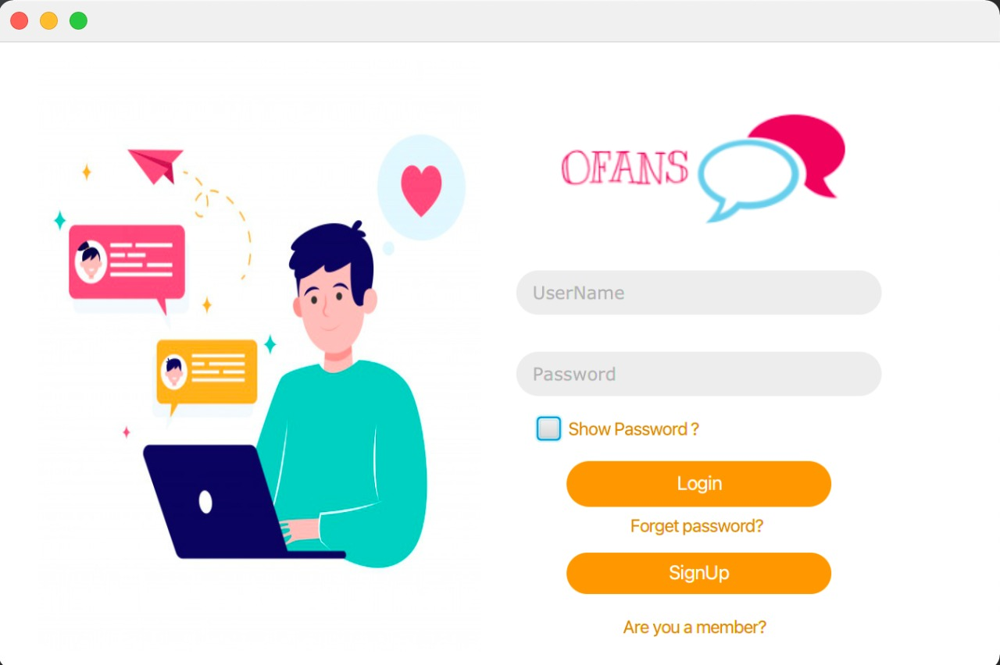
</p>

* ### Signup
<p align="left">
  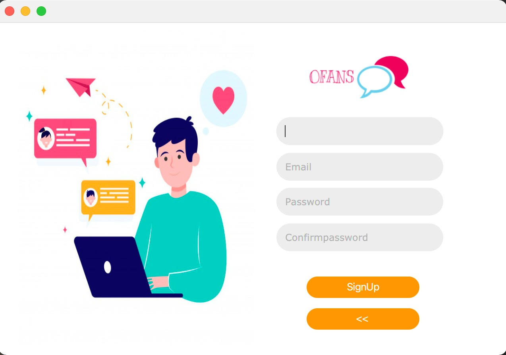
</p>

* ### Interface Utilisateur
<p align="left">
  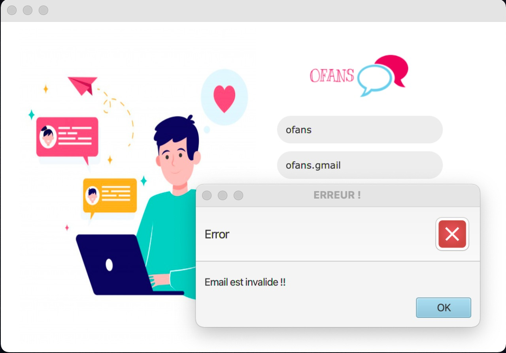
</p>

* ### Remplit les champs
<p align="left">
  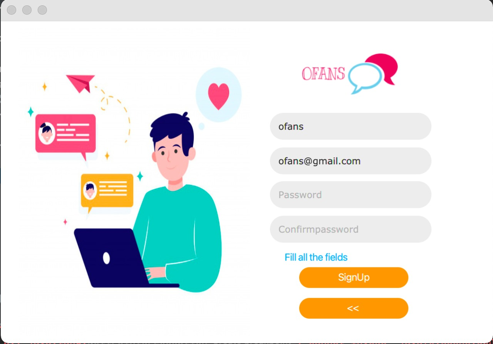
</p>

* ### Confirmation du mot de passe
<p align="left">
  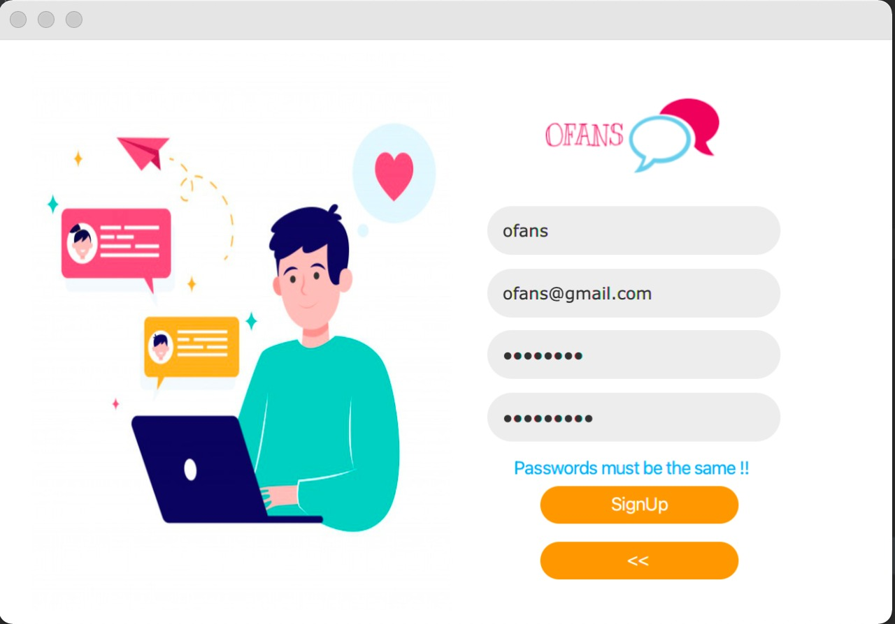
</p>

* ### Validité du mot de passe
<p align="left">
  
</p>

* ### Option d'afficher le mot de passe 
<p align="left">
  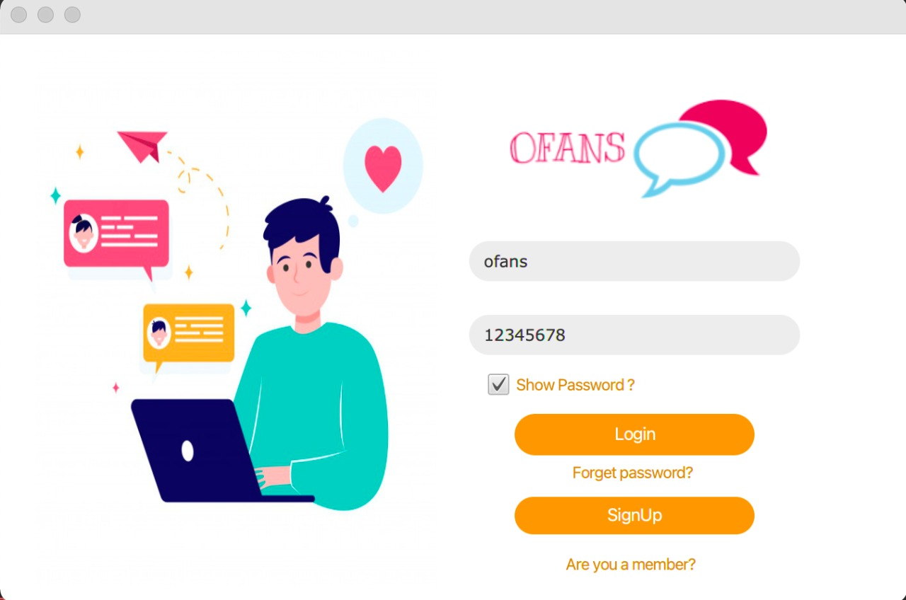
</p>

* ### Recevoir du mot de passe en cas d'oublie 
<p align="left">
  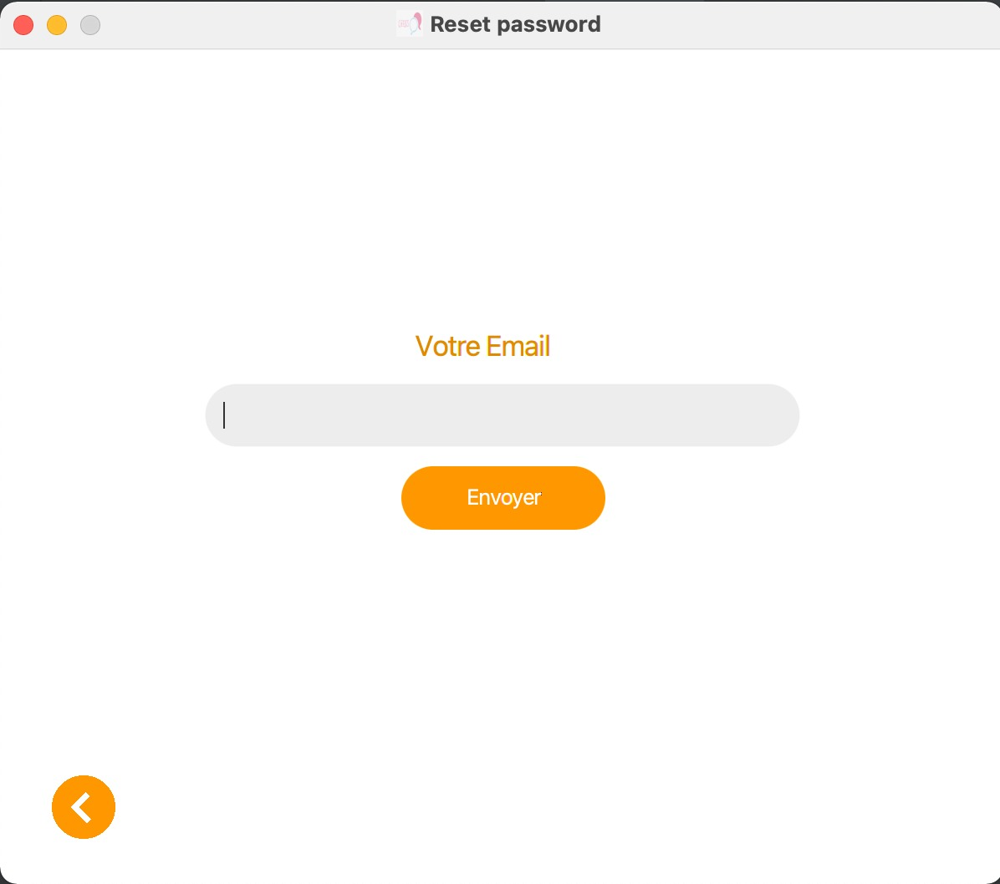
</p>

* ### Room
<p align="left">
  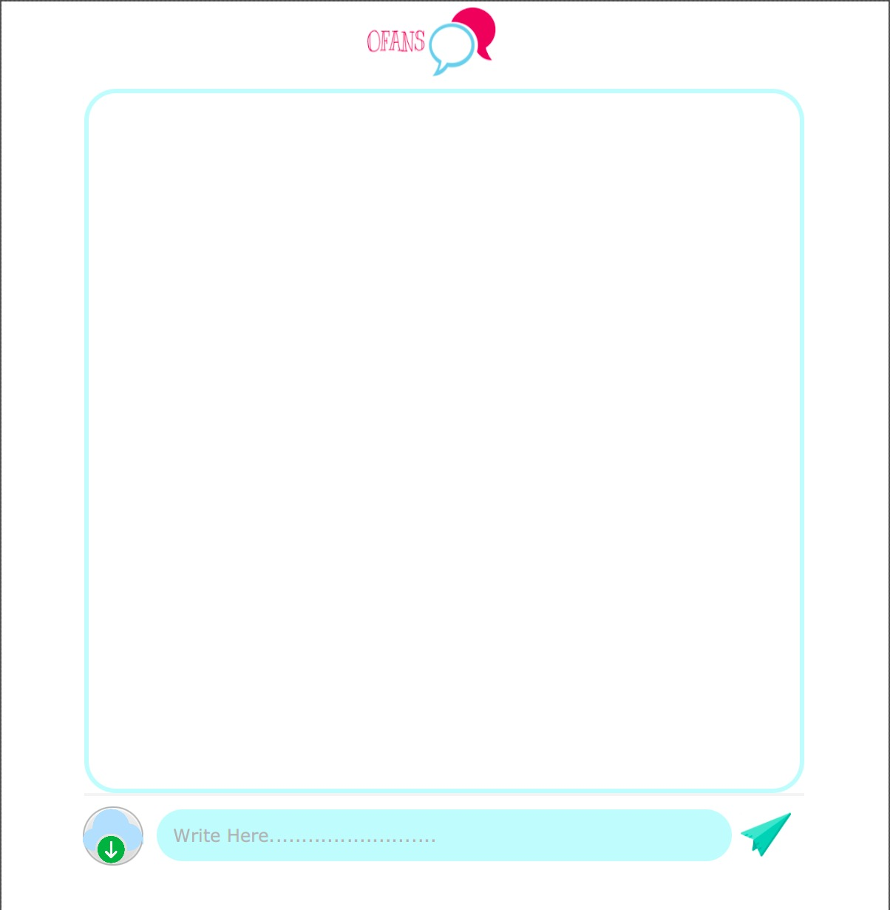
</p>

* ### Email invalide
<p align="left">
  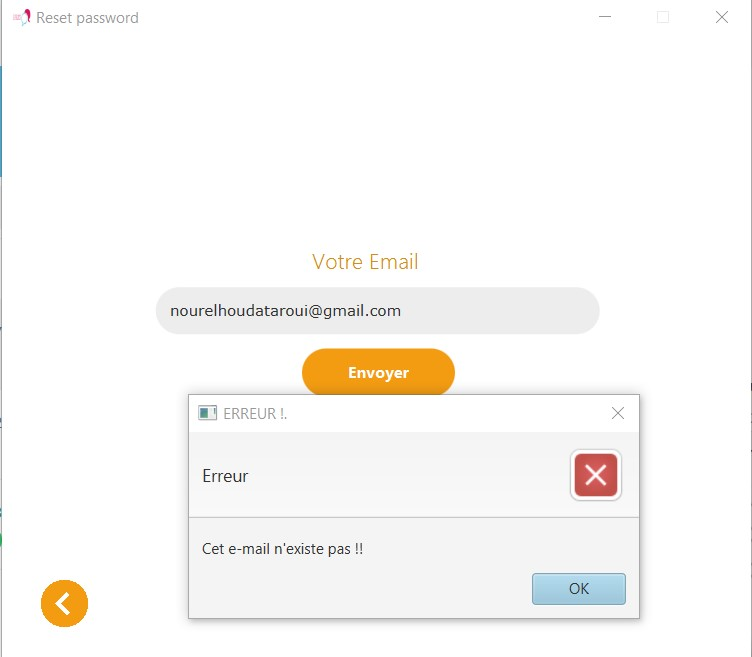
</p>

* ### Email valide
<p align="left">
  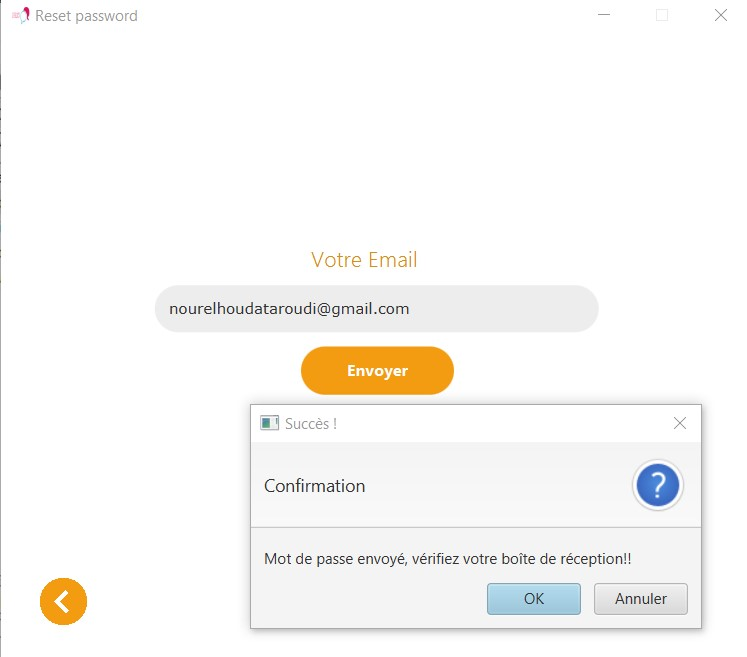
</p>

* ### Reçois de mail conteint mot de passe
<p align="left">
  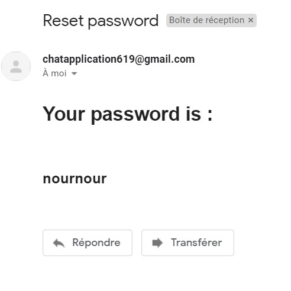
</p>

## Demo
<a href="https://s10.gifyu.com/images/Animationdb015d138f568377.gif"></a>


**Encadré par :** ***[Mr.Abderrazzak NEJEOUI](https://github.com/nejeoui)***

